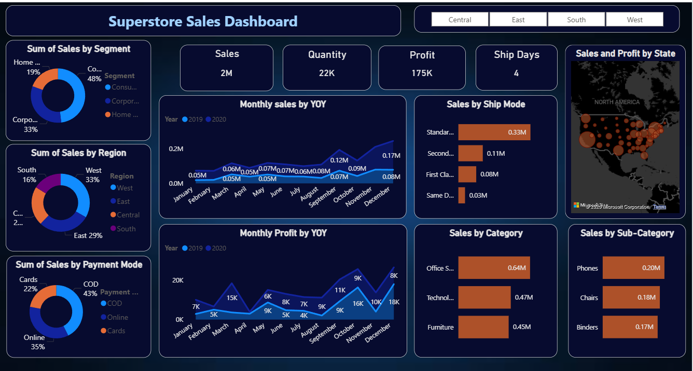
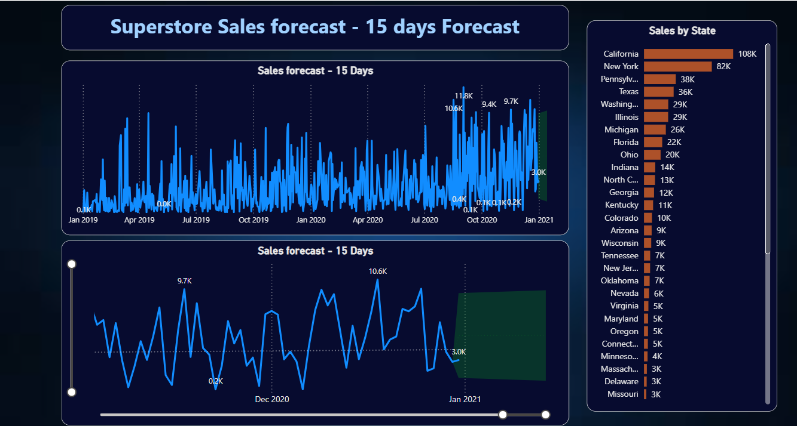

# Superstore-Sales-Analysis
A Power BI dashboard analyzing $2M in sales data, featuring YOY growth, regional performance, and profit trends.

## 📊 Project Visuals

### Sales Dashboard Overview

### 15-Day Sales Forecast

---

## 📂 Project Resources
* **[🚀 Download Interactive Power BI Report (.pbix)](<Superstore Sales Dashboard.pbix>)**
* **[📑 Access Raw Data](./Data)**

---

## 💡 Key Insights
* **Revenue Drivers:** Identified the West Region as the primary market contributor.
* **Forecasting:** Implemented a 15-day time-series forecast to assist in inventory planning.
* **Profitability:** Analyzed YOY trends to isolate peak seasonal performance.
